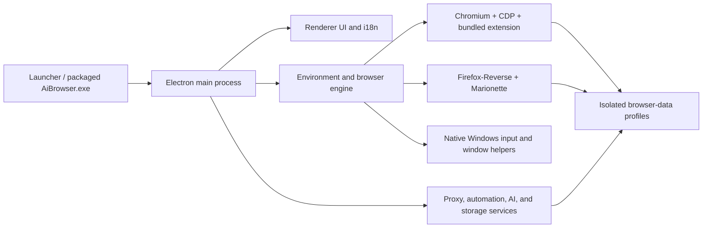

<p align="right">
  <strong>English</strong> | <a href="./README.zh-CN.md">简体中文</a>
</p>

<p align="center">
  
</p>

<h1 align="center">AiBrowser</h1>

<p align="center">
  A Windows desktop workspace for isolated multi-browser environments, synchronized interaction, automation, proxy profiles, and flexible window layouts.
</p>

<p align="center">
  <a href="https://github.com/PuppetWen/AiBrowser/stargazers"></a>
  <a href="https://github.com/PuppetWen/AiBrowser/releases/latest"></a>
  <a href="https://github.com/PuppetWen/AiBrowser/releases"></a>
  
  
</p>

## Overview

AiBrowser manages multiple isolated Chromium and Firefox environments from one desktop control center. Each environment has its own profile data, proxy settings, browser identity, tabs, and automation state. A floating synchronization controller can mirror supported interactions across selected environments without forcing windows back to an initial layout.

Maintained and released by [PuppetWen](https://github.com/PuppetWen).

Release packages include the desktop runtime, Chromium kernel, Firefox-Reverse kernel, and native Windows helpers. Core browser-management features do not require a separate Node.js, Electron, Chrome, or Firefox installation.

## Features

| Area | Capabilities |
| --- | --- |
| Environment management | Create, edit, group, launch, stop, and audit isolated browser environments |
| Browser engines | Bundled Chromium control through CDP and Firefox control through Marionette/native helpers |
| Input synchronization | Mouse, keyboard, text, tab, and supported browser UI synchronization across selected windows |
| Chinese IME handling | Composition-aware text synchronization avoids interrupting unfinished Pinyin input |
| Window management | Uniform tiling, cascade, maximize, minimize, restore, and Excel-style custom grid layouts |
| Proxy profiles | System, HTTP/HTTPS, and SOCKS proxy parsing, forwarding, retry, and environment assignment |
| Automation | Local automation workflows, script execution, reusable templates, and batch operations |
| Data portability | Project-relative paths and per-environment data stored beside portable builds |
| Desktop integration | Branded executable, stable Windows AppUserModelID, Start Menu shortcut, and taskbar pinning |
| Liquid glass themes | Translucent toolbars, path fields, dialogs, and sync controls across all six themes; native acrylic on Windows 11 22H2 or later, with solid accessible fallbacks |

Optional AI or cloud integrations may require credentials for the provider selected by the user. Credentials and browser profiles are local data and are intentionally excluded from this repository.

## Download

Open the [latest release](https://github.com/PuppetWen/AiBrowser/releases/latest), or use one of these assets:

| Package | Best for | Usage |
| --- | --- | --- |
| [ZIP portable package](https://github.com/PuppetWen/AiBrowser/releases/latest/download/AiBrowser-Windows-x86_64-with-kernel.zip) | Keeping the full app in a folder or USB drive | Extract the complete archive, then run `AiBrowser.exe` |
| [Single-file portable package](https://github.com/PuppetWen/AiBrowser/releases/latest/download/AiBrowser-Windows-x86_64-with-kernel-Portable.exe) | A simple first-run download | Run the EXE; it creates `AiBrowser-Portable` beside itself and starts the app |
| [Windows installer](https://github.com/PuppetWen/AiBrowser/releases/latest/download/AiBrowser-Windows-x86_64-with-kernel-Setup.exe) | Normal desktop installation | Run Setup and use `Uninstall.exe` when removal is needed |

The executables are currently unsigned. Windows SmartScreen may show an unknown-publisher warning on first launch.

## Portable usage

### ZIP package

1. Extract the entire ZIP to a writable directory.
2. Run `AiBrowser.exe` from the extracted folder.
3. Keep the generated `browser-data` directory with the application when moving it to another computer.

### Single-file package

1. Place the portable EXE in a writable directory.
2. Run it and wait for the adjacent `AiBrowser-Portable` directory to be created.
3. Start future sessions from `AiBrowser-Portable\AiBrowser.exe`, or run the wrapper again.
4. Copy the complete `AiBrowser-Portable` directory to retain profiles and settings.

### Taskbar pinning

If an older build was pinned as `Electron`, unpin that old entry once. Launch the current `AiBrowser.exe`, then pin the new AiBrowser taskbar item. The application publishes a stable AppUserModelID and a Start Menu shortcut that relaunches the branded executable.

## Architecture



| Layer | Main locations | Responsibility |
| --- | --- | --- |
| Desktop host | `Browserapp/main.js`, `Browserapp/preload.js`, `Browserapp/host-bridge.js` | App lifecycle, IPC, windows, taskbar identity, and secure renderer bridge |
| User interface | `Browserapp/index.html`, `Browserapp/renderer.js`, CSS files, `Browserapp/i18n.js` | Environment UI, window controls, layouts, localization, and workflow interaction |
| Browser control | `Browserapp/engine.js`, `Browserapp/cdp.js`, `Browserapp/marionette-client.js` | Launching, attaching, profile isolation, and browser protocol control |
| Synchronization | `Browserapp/live-sync-v5.js`, floating sync controller, native helpers | Cross-window mouse, keyboard, IME, text, tab, and window operations |
| Automation | `Browserapp/automation/`, `Browserapp/store-extension.js` | Workflows, local APIs, scripts, templates, storage, and batch operations |
| Networking | `Browserapp/proxy-forwarder.js`, system proxy modules | Proxy normalization, authentication, forwarding, and retry behavior |
| Packaging | `Browserapp/scripts/package-portable.js`, `launcher/` | Portable ZIP, single-file package, installer, and source launcher |

## Running from source

Release packages are recommended for normal use. Source development requires Windows, Node.js, npm, browser kernels, and a Windows C# compiler for rebuilding native helpers.

```powershell
git clone https://github.com/PuppetWen/AiBrowser.git
cd AiBrowser\Browserapp
npm install
node scripts\run-app.js
```

The large browser kernels, local runtime cache, generated native executables, user profiles, and release artifacts are not stored in Git. Download a release for a complete ready-to-run bundle, or provision development kernels under `Browserapp\kernels` before testing browser launch features.

## Building release packages

With the required kernels, native helpers, and NSIS toolchain available in the project workspace:

```powershell
cd Browserapp
node scripts\package-portable.js
```

Generated artifacts are written to `Browserapp\dist` and are intentionally excluded from source control.

## Privacy and security

- `browser-data`, account lists, proxy credentials, API keys, caches, logs, and test output are excluded from Git.
- Do not commit `.env` files, exported profiles, cookies, local databases, or screenshots containing account information.
- Review automation scripts before running them against third-party websites.
- This project does not bypass website policies; users are responsible for complying with applicable terms and laws.

## Contributing

Issues and pull requests are welcome. Please describe the browser engine, Windows version, reproduction steps, and whether synchronization was enabled when reporting a problem.

## Release verification

The Windows x86-64 release is tested for ZIP extraction, single-file portable startup, installer startup, uninstall cleanup, bundled Chromium/Firefox availability, portable data placement, and taskbar relaunch identity.
