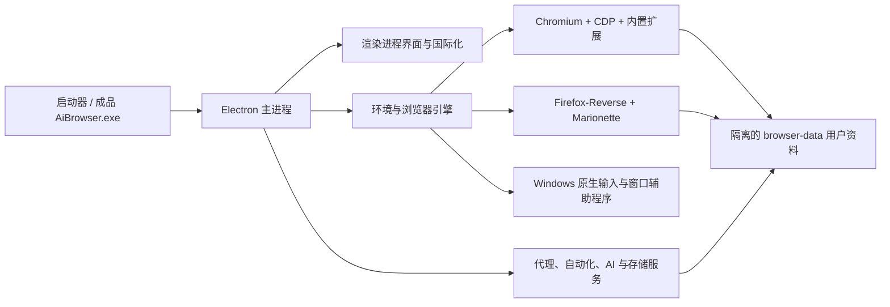

<p align="right">
  <a href="./README.md">English</a> | <strong>简体中文</strong>
</p>

<p align="center">
  
</p>

<h1 align="center">AiBrowser</h1>

<p align="center">
  面向 Windows 的多浏览器隔离环境、同步操作、自动化、代理配置与灵活窗口布局桌面工作台。
</p>

<p align="center">
  <a href="https://github.com/PuppetWen/AiBrowser/stargazers"></a>
  <a href="https://github.com/PuppetWen/AiBrowser/releases/latest"></a>
  <a href="https://github.com/PuppetWen/AiBrowser/releases"></a>
  
  
</p>

## 项目简介

AiBrowser 在一个桌面控制中心中管理多个相互隔离的 Chromium 和 Firefox 浏览器环境。每个环境拥有独立的用户资料、代理配置、浏览器身份、标签页和自动化状态。浮动同步控制器可以在选中的环境之间同步支持的操作，而且开启同步时不会强制恢复初始窗口布局。

项目由 [PuppetWen](https://github.com/PuppetWen) 维护并发布。

Release 成品已包含桌面运行时、Chromium 内核、Firefox-Reverse 内核和 Windows 原生辅助程序。核心浏览器管理功能不需要额外安装 Node.js、Electron、Chrome 或 Firefox。

## 功能

| 模块 | 功能说明 |
| --- | --- |
| 环境管理 | 创建、编辑、分组、启动、停止和审计隔离浏览器环境 |
| 浏览器内核 | 通过 CDP 控制内置 Chromium，通过 Marionette 和原生辅助程序控制 Firefox |
| 同步操作 | 在选中窗口之间同步鼠标、键盘、文本、标签页及支持的浏览器界面操作 |
| 中文输入法 | 感知输入法组合状态，避免拼音尚未完成时被同步逻辑提前打断 |
| 窗口管理 | 等大小平铺、层叠、最大化、最小化、恢复及 Excel 风格自定义网格布局 |
| 代理配置 | 系统代理、HTTP/HTTPS、SOCKS 解析、转发、重试及环境分配 |
| 自动化 | 本地自动化工作流、脚本执行、模板和批量操作 |
| 便携数据 | 项目相对路径，便携版环境数据保存在程序目录旁边 |
| 桌面集成 | 品牌启动程序、稳定 AppUserModelID、开始菜单快捷方式和任务栏固定 |
| 液态玻璃主题 | 6 套主题统一通透工具栏、路径框、弹窗和同步浮条；Windows 11 22H2 及以上使用原生亚克力背景，减少透明度和高对比度模式保留清晰实底 |

可选 AI 或云端集成功能可能需要用户自行配置对应服务商的凭据。凭据和浏览器用户资料属于本地数据，已明确排除在公开仓库之外。

## 下载

进入[最新 Release](https://github.com/PuppetWen/AiBrowser/releases/latest)，或直接选择以下文件：

| 文件 | 适用场景 | 使用方法 |
| --- | --- | --- |
| [ZIP 便携包](https://github.com/PuppetWen/AiBrowser/releases/latest/download/AiBrowser-Windows-x86_64-with-kernel.zip) | 完整放在文件夹或移动硬盘中使用 | 完整解压后运行 `AiBrowser.exe` |
| [单文件便携包](https://github.com/PuppetWen/AiBrowser/releases/latest/download/AiBrowser-Windows-x86_64-with-kernel-Portable.exe) | 希望只下载一个启动文件 | 运行 EXE，旁边会生成 `AiBrowser-Portable` 并自动启动 |
| [Windows 安装包](https://github.com/PuppetWen/AiBrowser/releases/latest/download/AiBrowser-Windows-x86_64-with-kernel-Setup.exe) | 常规桌面安装 | 运行 Setup，需要卸载时使用 `Uninstall.exe` |

当前 EXE 尚未进行数字签名，首次运行时 Windows SmartScreen 可能显示未知发布者提示。

## 便携包使用方法

### ZIP 便携包

1. 将 ZIP 完整解压到可写目录。
2. 运行解压目录中的 `AiBrowser.exe`。
3. 迁移到其他电脑时，将生成的 `browser-data` 与程序目录一起复制。

### 单文件便携包

1. 将便携 EXE 放入可写目录。
2. 运行后等待旁边生成 `AiBrowser-Portable` 目录。
3. 后续可直接运行 `AiBrowser-Portable\AiBrowser.exe`，也可以再次运行外层便携程序。
4. 需要保留环境和配置时，应复制完整的 `AiBrowser-Portable` 目录。

### 固定到任务栏

如果旧版本曾显示为 `Electron`，需要先取消固定旧图标一次。运行当前 `AiBrowser.exe` 后，再固定新的 AiBrowser 任务栏图标。程序会写入稳定的 AppUserModelID 和指向品牌启动程序的开始菜单快捷方式。

## 架构



| 层级 | 主要位置 | 职责 |
| --- | --- | --- |
| 桌面宿主 | `Browserapp/main.js`、`preload.js`、`host-bridge.js` | 应用生命周期、IPC、窗口、任务栏身份和安全渲染桥接 |
| 用户界面 | `index.html`、`renderer.js`、CSS、`i18n.js` | 环境界面、窗口控制、布局、国际化和工作流交互 |
| 浏览器控制 | `engine.js`、`cdp.js`、`marionette-client.js` | 内核启动、协议连接、用户资料隔离和浏览器控制 |
| 同步系统 | `live-sync-v5.js`、浮动同步控制器、原生辅助程序 | 鼠标、键盘、输入法、文本、标签页和窗口操作同步 |
| 自动化 | `Browserapp/automation/`、`store-extension.js` | 工作流、本地 API、脚本、模板、存储和批量操作 |
| 网络 | `proxy-forwarder.js`、系统代理模块 | 代理标准化、认证、转发和重试 |
| 打包 | `scripts/package-portable.js`、`launcher/` | ZIP、单文件便携包、安装包和源码启动器 |

## 从源码运行

普通用户建议直接下载 Release。源码开发需要 Windows、Node.js、npm、浏览器内核，以及用于重新编译原生辅助程序的 Windows C# 编译器。

```powershell
git clone https://github.com/PuppetWen/AiBrowser.git
cd AiBrowser\Browserapp
npm install
node scripts\run-app.js
```

体积较大的浏览器内核、本地运行时缓存、生成的原生 EXE、用户资料和发布包不会存入 Git。需要完整开箱即用版本时请下载 Release；开发浏览器启动功能前，需要自行在 `Browserapp\kernels` 中准备开发内核。

## 构建发布包

在项目工作区已经具备浏览器内核、原生辅助程序和 NSIS 工具链的情况下执行：

```powershell
cd Browserapp
node scripts\package-portable.js
```

生成结果位于 `Browserapp\dist`，该目录不会提交到源码仓库。

## 隐私与安全

- `browser-data`、账号列表、代理凭据、API Key、缓存、日志和测试结果不会提交到 Git。
- 不要提交 `.env`、导出的浏览器环境、Cookie、本地数据库或包含账号信息的截图。
- 对第三方网站运行自动化任务之前，请先审查脚本内容。
- 本项目不用于规避网站规则，使用者应自行遵守相关服务条款和法律法规。

## 参与贡献

欢迎提交 Issue 和 Pull Request。反馈问题时请提供浏览器内核、Windows 版本、复现步骤，以及问题发生时是否开启了同步操作。

## 发布验证

Windows x86-64 成品已经实际测试 ZIP 解压启动、单文件便携启动、安装包启动、卸载清理、Chromium/Firefox 内核完整性、便携数据位置和任务栏重新启动身份。
